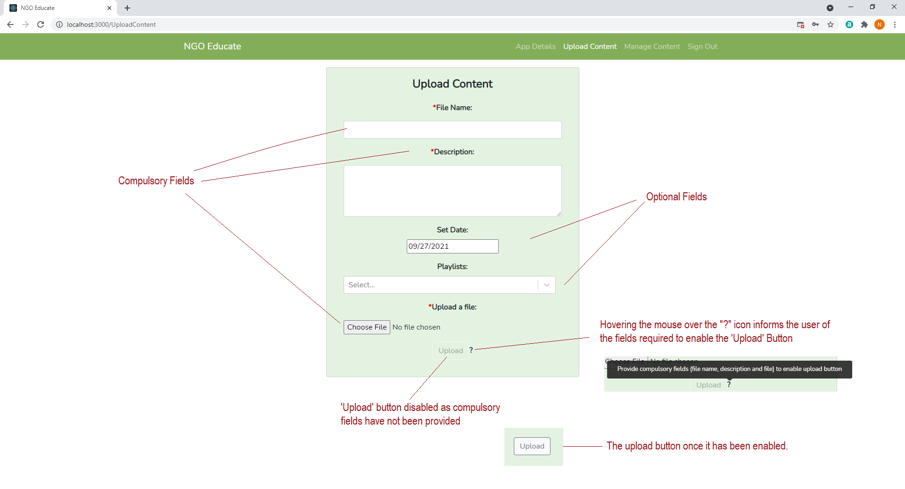

# Content Manager User Documentation #

## Installation: ##
1. Download the project, that has been submitted on Vula.
2. Import the project into your IDE.
3. Open your terminal and make your way to the project directory.
4. Enter' yarn install' to install all dependencies for the project.
5. Enter 'yarn start' into the terminal to run the project in development mode.
6. Ensure you are also running the Backend as well.

## Libraries: ##

  
 Sign in 

  
This is the landing page of NGO Educate. You are required to Sign In before accessing the site.

  
    1. Enter your email address.
    2. Enter your password.
    3. Click the 'Sign In' button.

  
 Create App 

  
If you have not created an app yet, you will be directed to this page. Here you must provide a name and description for your app as well as an app logo. The 'Generate App' button will enable once all the required fields have been filled. 

    1. Enter a name for your app.
    2. Enter a description for your app.
    3. Upload an image to be used as the app logo.
    4. Click the 'Generate App' button and you will then be redirected to the 'App Details' page.

  
 View App Details 

  
This page allows you to view the details of the app you created and download the APK.

  

  
NGO Educate

  
This is the home page which provides summary statistics as well as links to important pages.

  

  
Upload Content

  
This page allows you to upload content (e.g. videos, images, etc) to your app.

  
    1. Enter a name for the content.
    2. Enter a description.
    3. Select a file from your device that you want to upload.
    4. You may select which playlist(s) to add the content to and select a date, however these fields are not required.
    5. Hovering your mouse over the "?" alongside the disabled 'Upload' button informs you of the required fields that you must provide to upload content.
    6. Once the name, description and file have been provided, the 'Upload' button will enable. Click the button and confirm to upload content.
  
  Markup : 

  

  
Manage Content

  
This page lists all your playlists. You can click on a playlist card to view the details of the selected playlist. It also containts a 'New Playlist' and 'All Content' buttons which allow you to create a new playlist or view all your uploaded content, respectively. A search bar is also available where you can search for a playlist.

  

  
All Content

  
This page lists all the content you have uploaded. You can use the search bar to find a specific piece of content. Clicking a content card redirects you to the 'View Content' page.

  

  
New Playlist

  
This page allows your to create a new playlist.
  
  
    1. Enter a name for the playlist.
    2. Enter a description for the playlist.
    3. Hovering your mouse over "?" next to the 'Create' button will inform you of the fields you are required to fill to enable the 'Create' button.
    4. Click the 'Create' button and confirm to create the new playlist.

  

  
View Playlist

  
This page will provide the name, description and content associated with the selected playlist. It also contains a 'Back,' 'Edit' and 'Delete' button which will redirect you page to the previous page, allow you to edit the playlist, and delete the playlist respectively. You may also click on a piece of content to view its details.

  

  
Edit Playlist

  
This page allows you to change the name and description of the selected playlist, and add or remove content to/from the playlist.

    
    1. Enter a new name and/or description.
    2. Click the 'Change' button and confirm changes.
    3. Use the dropdown menu to view all uploaded content. Select the content that you want to add to the playlist.
    4. Click 'Add Content' and confirm changes.
    5. Click the 'Remove' button next to each piece of content that you want to remove from the playlist.
    6. Click the 'Back' button to go back to 'View Playlist' and see your changes.

  
View Content

  
This page allows you to see the name, description and file of the selected content. It also provides the number of views and any feedback it has received. Clicking the 'Open' button will either open the file in another tab or will download the file, depending on the file format. The 'Back,' 'Edit' and 'Delete' buttons redirects you back to the previous page, allows you to edit the content and delete the selected content respectively.

  

  
Edit Content

  
This page allows you to change the name and description of the selected content.

      
    1. Enter a new name and/or description.
    2. Click the 'Save' button and confirm changes.

  
 Sign Out

  
This button will sign you out and redirect you to the 'Sign In' page.

